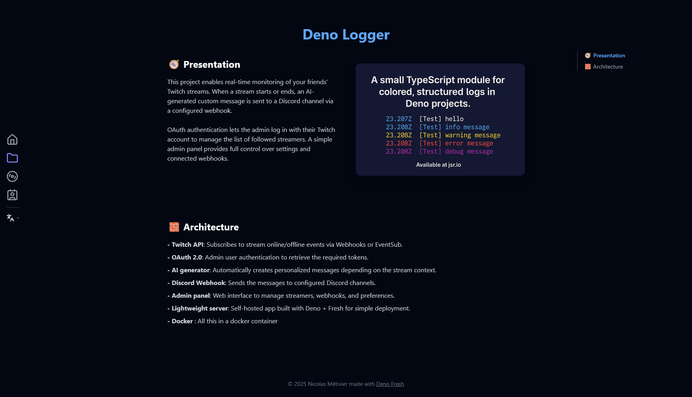

# My website nicolas-metivier.fr


This is the source code for my personal website, built with [Fresh](https://fresh.deno.dev/) and [Deno](https://deno.land/). It showcases my projects, music, contact information,and includes a dynamic icon browser powered by [Lucide Icons](https://lucide.dev/), and [Tailwind CSS](https://tailwindcss.com/) for the styling system.



## 🚀 Features

- Fully responsive design
- Tailwind CSS for rapid UI development
- Smooth animations using custom utilities
- Project showcase with detailed pages
- Music section with artwork
- Contact page (without form, email and social links only)
- Dynamic icon viewer (powered by Lucide Icons)
- Color palette preview for Tailwind configuration
- Modular and component-based architecture
- Section registry system for dynamic section loading
- Project cards with dynamic routing
- Copy-to-clipboard functionality
- Multilingual support (currently French and English)

## 📦 Stack

- **Fresh (Deno Framework)**
- **Preact (JSX components)**
- **Tailwind CSS**
- **Lucide Icons**
- Deployed on a self-hosted Docker-based infrastructure

## 🛠️ Local Development

### Prerequisites

- [Deno](https://deno.land)
- [Fresh](https://fresh.deno.dev) CLI

## 🌐 Project Structure

- `components/` – UI components
- `data/` – Static data (icons, projects, pages, etc.)
- `islands/` – Client-side components
- `routes/` – Site pages
- `static/` – Static images and CSS
- `utils/` – Utility functions
- `types.ts` – Global types
- `deno.json` – Deno + Fresh configuration

### Start the development server

```bash
deno task start
```

Then visit `http://localhost:8000` in your browser.

## 🤝 Acknowledgments

- **[Lucide](https://github.com/lucide-icons/lucide)** for the icon set and metadata used in the icon browser
- **[Fresh](https://fresh.deno.dev/)** for the server-side rendering and routing framework
- **[Tailwind CSS](https://tailwindcss.com/)** for the styling system

## 📄 License

All rights reserved © 2025 [nicolas-metivier.fr](https://nicolas-metivier.fr)  
Reproduction, distribution, or use is restricted to Nicolas Metivier without prior permission.
